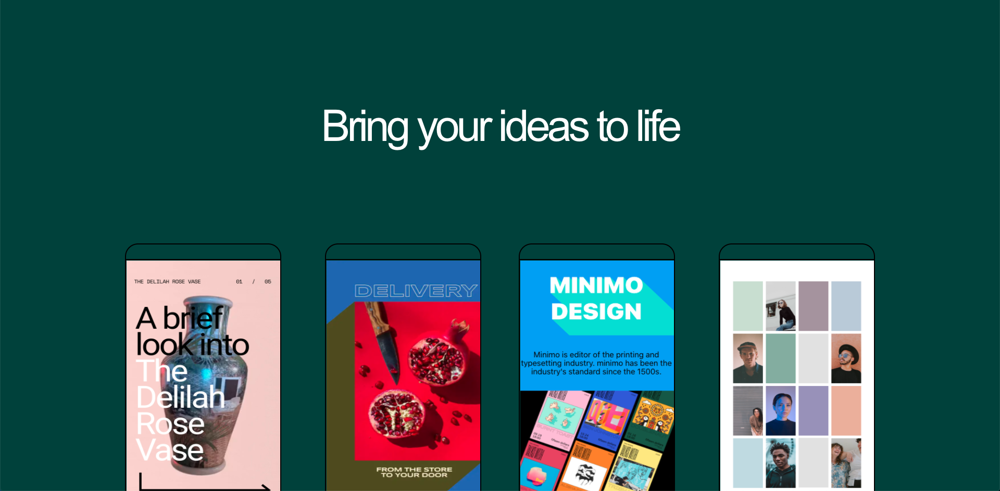
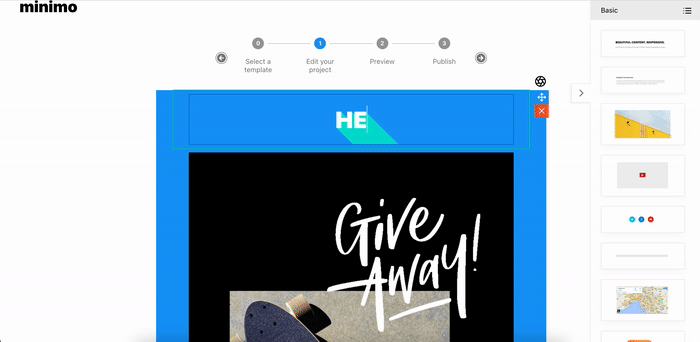
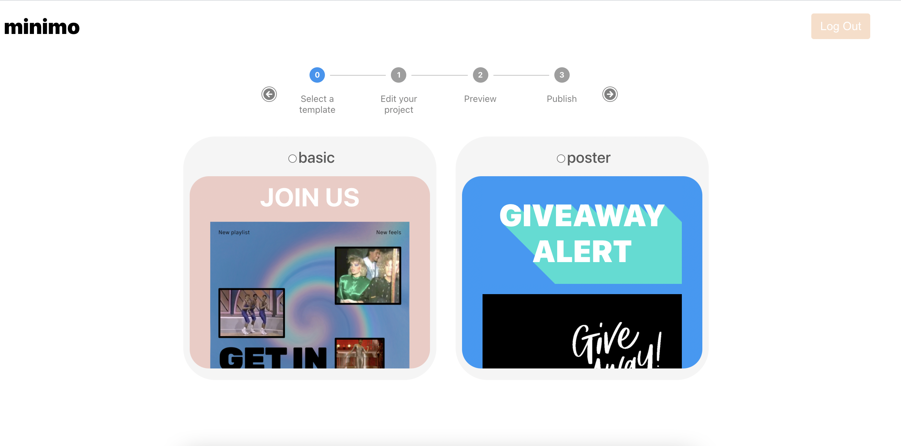
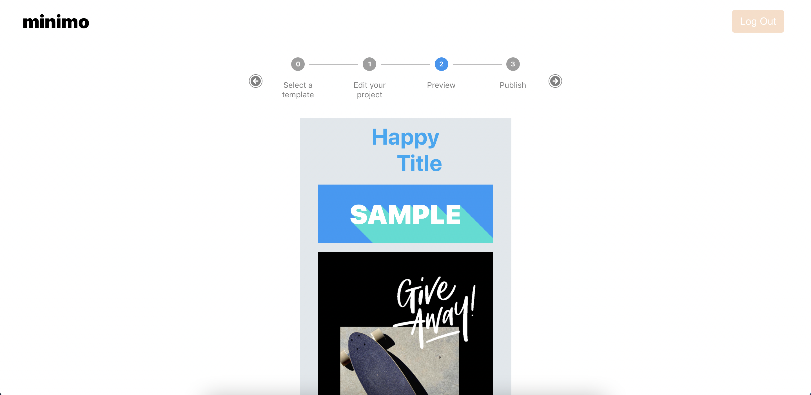
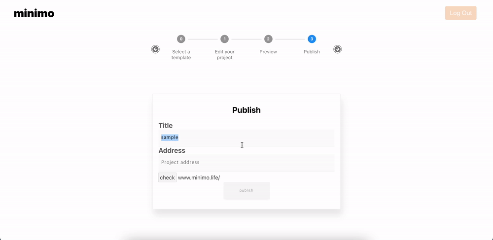

# minimo

 **미니모**는 모바일 초대장, 행사 포스터 등을 드래그 앤 드롭으로 쉽게 제작할 수 있는 미니 웹 빌더입니다.





  
  
  
  
  
  
  
  
  
  
  
  
  
  
  
  

🔗  [발표영상](https://youtu.be/F8OHnevCS30?t=7328) -
3분 내외의 간단한 기능소개 부분입니다. 전체적인 기능을 보실 수 있습니다.

🔗  배포링크: [https://www.minimo.life](https://www.minimo.life/)

🔗  frontend: [https://github.com/minimo-editor/minimo-client](https://github.com/minimo-editor/minimo-client)

🔗  backend: [https://github.com/minimo-editor/minimo-server](https://github.com/minimo-editor/minimo-server)

---
## 🛠 기술 스택

  - Frontend
    - React
    - ContextAPI
    - ES6
    - Styled-components
    - Google-Maps-API
    - Immer
    - AWS-S3
    - Jest
    - React-testing-library

  - Backend
    - Node.js
    - Express.js
    - MongoDB
    - Mongoose
---

## ✨ 목차

  - [🏄‍♂️ 프로젝트 개요](#%EF%B8%8F-프로젝트-개요)
  - [📅 작업 기간](#-작업-기간)
  - [🕹 기능](#-기능)
  - [🧑‍💻 TECH STACK WHY?](#-tech-stack-why)
  - [⛑ TEST](#-test)
  - [💡 특징](#-특징)
  - [📖 프로젝트 사용 방법](#-프로젝트-사용-방법)
  - [🧑‍💻 프로젝트를 마치며](#-프로젝트를-마치며)

---

## 🏄‍♂️ 프로젝트 개요

미니모 웹 빌더는 모바일 청첩장에서 시작된 아이디어입니다.

결혼을 할 때 사람들은 웨딩홀, 드레스, 반지 등 모든것을 최고로 화려하게 합니다.
하지만 모바일 청첩장은 보통 정적이며 최고는 아니라고 생각했습니다.
특히 코로나로인해 결혼식 불참이 많은 상황에서, 모바일 청첩장을 더 특별하게 만들면 좋겠다고 생각했습니다.

현대의 웹은 3D, 실시간 인터렉션, parallax scrolling 등 재밌는 요소도 많이 추가할 수 있습니다.
이러한 것들을 바쁘게 결혼 준비하시는 분들이 쉽고 빠르게 만들 수 있는 웹 빌더를 만들고 싶었습니다.

개발 기간이 2주로 짧기 때문에, 이번 개발 기간동안에는 아래와 같은 목표를 갖고 진행하였습니다.

- 추후에 편하게 블록(에디터 기능)을 추가할 수 있게 확장성 있게 만들기
- 유저 경험에 핵심적인 드래그 앤 드롭을 라이브러리 없이 직접 만들기
- 기본적인 블록 요소들(텍스트, 동영상, 사진 등)이 포함된 에디터를 잘 만들기
- 컴포넌트들을 재사용성 있게 하여 추후에 블록에 추가할 수 있게 만들기

따라서 청첩장 보다는 확장성 있는 웹 빌더 형식으로 하게 되었고, 이번 프로젝트 기간동안 기본 툴을 만들기로 했습니다.

---

## 📅 작업 기간

- **기획 :** 2021/05/03 ~ 2021/05/07 **(1주)**
    - 아이디어 브레인스토밍, 기획, 기술 검증
    - [minimo wireframe](https://www.notion.so/minimo-wireframe-3fd7effb57b54c0791e1b793b5f5fbdd) 작성

- **개발 :** 2021/05/10 ~ 2021/05/21 **(2주)**
    - **2주차**
        - `에디터` 및 `드래그 앤 드롭` 등 핵심 기능 구현
        - `사용자 인증`, `전역 상태관리` 등
    - **3주차**
        - `컴포넌트` 및 `커스텀 훅` 재사용성 있게 리팩토링
        - 드래그 드롭 `애니메이션`, `추가 블록`, 기능 등
        - `유닛 테스트` 및 `배포`

---

## 🕹 기능

🔗  [발표영상](https://youtu.be/F8OHnevCS30?t=7328) -
3분 내외의 간단한 기능소개 부분입니다. 전체적인 플로우를 보실 수 있습니다.

- 기본 템플릿을 선택할 수 있습니다.
- 드래그 드롭을 통해 쉽게 블록들을 추가할 수 있습니다.
- 이미지, 동영상, 유튜브 영상 등을 추가할 수 있습니다.
- 소셜 미디어 버튼에 개인 링크를 연결할 수 있습니다.
- 특정 위치를 지도에 마크하여 주소와 함께 표시할 수 있습니다.
- 모바일 화면에 맞게 미리보기가 가능합니다.
- 원하는 주소를 설정할 수 있습니다.

| | |
| --- | --- |
| 템플릿 선택 | 배경 변경 / 블록 추가 / 소셜링크 |
|  | |
| 지도 블락 및 이미지 변경 | 텍스트 편집 |
|  |  |
| 블록 스왑 및 삭제 | 모바일 화면 미리보기 |
|  |  |
| youtube / video 블락 | blank(공백) 블락 |
|  |  |
| 발행 / 주소설정 | 발행된 페이지 (모바일 화면) |
|  |  |

---

## 🧑‍💻 TECH STACK WHY?

### 1. CONTEXT API + useReducer VS Redux

- 초기 설계단계에서는 전역 상태는 단순히 `prop-drilling`을 막기 위한 정도였기 때문에 `Context API`를 선택했습니다.

- 구현을 하면서 `Editor(project)`의 상태관리 로직이 커져서 `Redux`를 사용할지 `Context API + useReducer`를 사용할지 고민했는데,
  제 프로젝트는 `Redux`가 제공하는 여러 기능도 필요가 없었고, 상태의 변화가 그렇게 빈번하지 않기 때문에 굳이 `Redux`를 받아 번들링 사이즈를 키우기 보단 `Context API + useReducer`를 선택하게 되었습니다.

---

## ⛑ TEST

  - `React Testing Library`와 `Jest`를 사용하여 `Custom Hook`, `util`, `reducer` 등의 중요 로직을 우선적으로 유닛 테스트를 작성했습니다.

---

## 💡 특징

- WYSIWYG (What You See Is What You Get)

    프로젝트를 제작/편집 하는 과정에서의 모습 그대로 결과물이 나오도록 구현하였습니다.

- Block 단위 에디터

    미니모는 전통적인 WYSIWYG 에디터와 다르게 block 단위로 구현하였습니다.

    전통적인 WYSIWYG는 하나의 `contenteditable` 요소 안에 서로다른 `html markup` 을 작성하는 방식인데, 이는 편집하는 각각의 요소가 서로에게 영향을 주는 작은 버그가 존재합니다. 저도 이러한 불편함을 겪어본 적이 있기 때문에, 미니모는 `paragraph`, `title`, `image` 등을 각각 독립적인 `contenteditable` 요소로서 편집하도록 구현했습니다.

- Clean output data

    프로젝트의 결과물은 `html markup` 이 아닌 `json` 형식의 데이터로 저장하였습니다.

    몇몇 에디터, 블로그 서비스 등에서 `html markup` 형태로 데이터를 저장하여 많은 고민을 했지만, `json` 형식에 장점이 더 많다고 생각하여 `json` 형식으로 저장하였습니다.

    `html markup` 형식

    ```jsx
    <section name="0ed1" class="section section--body section--first">
       <div class="section-divider">
          <hr class="section-divider">
       </div>
       <div class="section-content">
          <div class="section-inner sectionLayout--insetColumn">
             <h3 name="f8e8" class="graf graf--h3 graf--leading graf--title">
                <br>
             </h3>
             <p name="83d3" class="graf graf--p graf-after--h3">
                So what do we have?
             </p>
          </div>
       </div>
    </section>
    <section name="d1d2" class="section section--body">
      ...
    </section>
    ```

     minimo의 `json` 형식

    ```jsx
    {
        "_id": "60a8ac7ec767550586e16766",
        "address" : "freeboard",
        "concept": "basic",
        "blocks" : [
            {
                "type" : "paragraph",
                "data" : {
                    "contents" : {
                        "texts": "<p>this is free<p>"
                    },
                    "styles": {
                        "color": "black"
                    }
                }
            },
            {
                "type" : "title",
                "data" : {
                    "contents" : {
                        "texts": "give away alert"
                    },
                    "styles": {
                        "color": "red"
                    }
                }
            },
            {
                "type" : "image",
                "data" : {
                   "contents" : {
                        "src": "https://minimo.s3.amazonaws.com/project-image/any.png"
                    }
                }
            }
        ],
       "createdAt": "2021-05-22T07:02:22.401Z"
    }
    ```

    위와같은 `json` 형태로 데이터를 저장 함으로써, 현재 사용하는 minimo 웹 뿐만 아니라, native, desktop app, 오디오 리더, 챗봇 등에게도 쉽게 적용할 수 있을거라 생각되었습니다.

    또한 백엔드에서의 validation도 더 용이하고, 특정 부분의 데이터만 추출하는 데에도 수월할 것이라고 생각했습니다.

---

## 📖 프로젝트 사용 방법

1. 디렉토리 이동
    ```
    // client

    cd minimo-client

    // server

    cd minimo-server
    ```

2. package.json에 정의된 패키지 설치
    ```
    npm install
    ```

3. Firebase Realtime Database 사용에 필요한 `dotenv` 설정

    디렉토리 최상단에 `.env.example`을 `.env`로 변경 후 아래의 값들을 변경

    ```
    // client

    REACT_APP_API_KEY=[FIREBASE_CONFIG_API_KEY]
    REACT_APP_AUTH_DOMAIN=[FIREBASE_CONFIG_AUTH_DOMAIN]

    REACT_APP_SERVER_URL=[SERVER_URL]

    REACT_APP_AWS_ACCESS_KEY=[AWS_S3_ACCESS_KE]
    REACT_APP_AWS_SECRET_KEY=[AWS_S3_SECRET_KEY]

    REACT_APP_GOOGLE_API_KEY=[GOOGLE_API_KEY]

    // server

    PORT=[PORT_NUMBER]
    MONGO_URL=[MONGO_DB_URL]
    ```
<br>

4. 실행
   ```
   // client

   npm start

   // server

   npm run dev
   ```

---

## 🧑‍💻 프로젝트를 마치며

- 프로젝트를 끝내고 스스로 잘했다고 생각한 점은 핵심 기능 관련 라이브러리를 사용하지 않았다는 것 입니다.

    이전 프로젝트에서 'react-three-fiber'라는 라이브러리를 사용했는데, 내부에서 돌아가는 three.js, canvas, webGL을 잘 모른 채 사용하여 문제들을 해결하기 어려웠고 원하는 대로 구현하지 못한 부분도 있었습니다.

    따라서 이번에는 핵심 기능 관련 라이브러리를 사용하지 않고 기본 web api를 이용하여 구현하려 했습니다. 덕분에 어려운 상황을 만났을 때, MDN과 stackoverflow 등을 통해 기본 api의 특성을 학습하며 문제를 해결할 수 있었습니다. 또한, 이후에 관련 라이브러리 사용 시에도 더 깊게 이해하고 사용할 수 있을 거라 기대합니다.

- 또한 회사에서 디자이너님과 작업을 한다고 가정하고, 기술적 편의를 위해 초기 wireframe의 디자인을 바꾸지 않기로 마음먹었는데, 이를 잘 지켜서 초기 디자인과 같은 결과물을 만든 점도 잘 했다고 생각합니다.

- 평소 생산성이 높은 웹앱에 관심이 많았는데, 직접 만들어 볼 수 있어서 너무 재밌었습니다. 추후에 parallax scroll 애니메이션, 선물리스트 등 재밌고 인터렉티브한 요소들을 포함한 블락들을 더 추가할 예정인데 너무 재밌을 것 같네요. 😄
